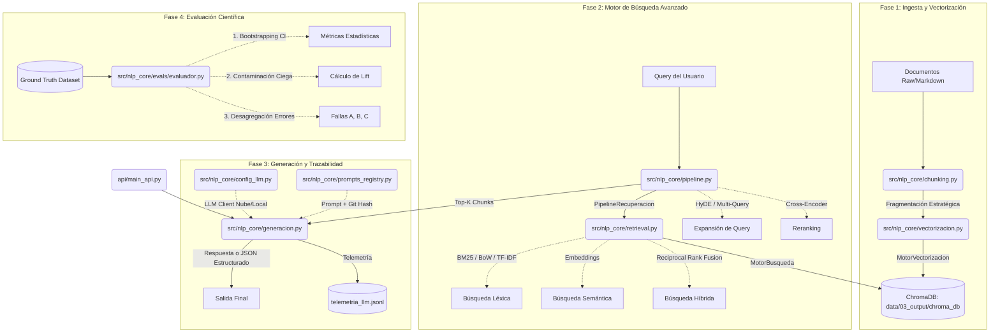

# Arquitectura y Flujo del RAG - Proyecto DISF

Este documento detalla la arquitectura modular y orientada a objetos de nuestro sistema RAG (Retrieval-Augmented Generation) avanzado. El diseño está construido para ser agnóstico del LLM (soporta Nube y Local) y altamente evaluable.

> 🔍 **Diagramas de Arquitectura Especializados (Zoom-in):**
> Para un análisis más detallado de cada componente, consulta los siguientes diagramas:
> - [Arquitectura Interna del NLP Core (Orquestación)](./Diagrama_Arquitectura_NLP_Core.md)
> - [Arquitectura del Módulo de Ingesta (ETL Vectorial)](./Diagrama_Arquitectura_Ingesta.md)
> - [Arquitectura del Módulo Evaluador (MLOps & Juez)](./Diagrama_Arquitectura_Evaluador.md)

## Diagrama de Flujo General (Mermaid)

El siguiente diagrama muestra cómo interactúan los distintos módulos, desde la ingesta de documentos hasta la generación y evaluación:

---

## Detalle de Scripts Relevantes y sus Funcionalidades

### 1. `src/nlp_core/config_llm.py`
**Responsabilidad:** El puente de conexión (Factory) hacia los modelos de IA.
- **Funcionalidades Permitidas:** Lee el archivo `.env` y expone funciones para obtener clientes de OpenAI (API oficial) o locales (Ollama). Dependiendo de si la tarea es de "extracción" o "qa", puede rutear a diferentes modelos (ej. Llama 3 para QA, GPT-4o para extracción). También provee el motor de Embeddings.

### 2. `src/nlp_core/prompts_registry.py` (Trazabilidad)
**Responsabilidad:** Repositorio inmutable de instrucciones para el LLM.
- **Funcionalidades Permitidas:** Carga prompts desde un archivo `.json`. Calcula un Hash SHA-256 del texto y dinámicamente inyecta el **Git Commit Hash** del proyecto. Garantiza que en auditorías se sepa exactamente qué instrucción y qué código se usó en cada respuesta.

### 3. `src/nlp_core/retrieval.py` (`MotorBusqueda`)
**Responsabilidad:** Matemáticas de búsqueda. Interactúa directamente con la base de datos (ChromaDB).
- **Funcionalidades Permitidas:** 
  - `buscar_similitud`: Búsqueda vectorial tradicional.
  - `buscar_bm25` / `buscar_tfidf`: Búsqueda de palabras clave exactas (Léxica).
  - `buscar_hibrido`: Combina ambas búsquedas anteriores usando un algoritmo estadístico llamado **Reciprocal Rank Fusion (RRF)** para equilibrar los resultados.

### 4. `src/nlp_core/pipeline.py` (`PipelineRecuperacion`)
**Responsabilidad:** Mejorar y refinar la búsqueda. Es la capa inteligente encima del `MotorBusqueda`.
- **Funcionalidades Permitidas:**
  - **Query Expansion (HyDE / Multi-Query):** Modifica la pregunta del usuario (creando un documento hipotético o 3 variantes de la pregunta) antes de buscar.
  - **Post-Processing (Cross-Encoder):** Toma los resultados en bruto y usa un modelo especializado secundario para reordenarlos (Reranking) de mayor a menor precisión.

### 5. `src/nlp_core/generacion.py` (Antes *agente.py*)
**Responsabilidad:** Prompt Engineering y Síntesis. Habla directamente con el LLM.
- **Funcionalidades Permitidas:**
  - Recibe los fragmentos encontrados por el pipeline y los **agrupa lógicamente por documento de origen** (Soporte Multi-Documento).
  - Inyecta el contexto y la pregunta al LLM.
  - Genera la respuesta en texto libre (`responder_rag_qa`) o en un JSON Pydantic estricto (`extraer_rag_simple`).
  - Escribe el consumo de tokens y latencia en el archivo de telemetría.

### 6. `src/nlp_core/evals/evaluador.py` (`EvaluadorRAG`)
**Responsabilidad:** El "Juez" implacable del sistema.
- **Funcionalidades Permitidas:**
  - Evaluar la calidad del sistema usando `NDCG@10` y `Recall`.
  - **Bootstrap:** Calcular la significancia estadística para asegurar que los resultados no son obra de la casualidad.
  - **Contaminación Ciega:** Evaluar cuánto "sabe" el LLM por sí solo sin ayuda del RAG.
  - **Desagregación:** Etiquetar exactamente dónde falla el sistema (Retrieval A, Alucinación B, o Formato C).

### 7. `api/main_api.py`
**Responsabilidad:** Exponer el sistema al mundo exterior.
- **Funcionalidades Permitidas:** Servidor web FastAPI que recibe peticiones HTTP del frontend (HTML/JS) y manda llamar a `generacion.py`. Retorna los resultados de forma estandarizada a las interfaces gráficas.
