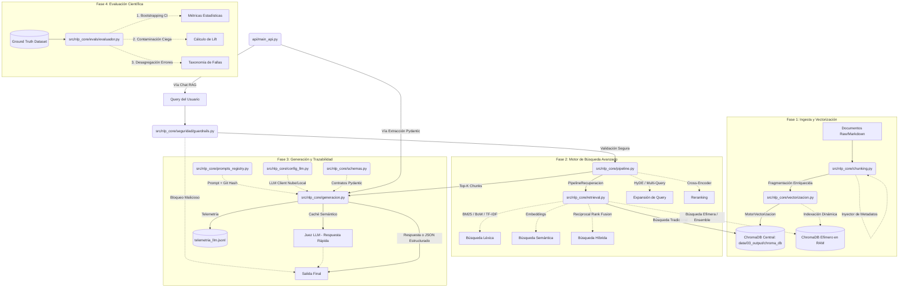

# Arquitectura y Flujo del RAG - Proyecto DISF

Este documento detalla la arquitectura modular y orientada a objetos de nuestro sistema RAG (Retrieval-Augmented Generation) avanzado. El diseño está construido para ser agnóstico del LLM (soporta Nube y Local) y altamente evaluable.

> 🔍 **Diagramas de Arquitectura Especializados (Zoom-in):**
> Para un análisis más detallado de cada componente, consulta los siguientes diagramas:
> - [Arquitectura Interna del NLP Core (Orquestación)](./diagrama_arquitectura_nlp_core.md)
> - [Arquitectura del Módulo de Ingesta (ETL Vectorial)](./diagrama_arquitectura_ingesta.md)
> - [Arquitectura del Módulo Evaluador (MLOps & Juez)](./diagrama_arquitectura_evaluador.md)
> - [Estrategia y Gobernanza de Datos (Extracción Structurada)](./extraccion_y_gobernanza_datos.md)

## Diagrama de Flujo General (Mermaid)

El siguiente diagrama muestra cómo interactúan los distintos módulos, desde la ingesta de documentos hasta la generación y evaluación:

```mermaid
graph TD
    %% Seguridad
    U[Query del Usuario] --> GR(src/nlp_core/seguridad/guardrails.py)
    GR -->|Validación Segura| E(src/nlp_core/pipeline.py)
    GR -.->|Bloqueo Malicioso| O[Salida Final: Rechazo]

    %% Ingesta y Vectorización
    subgraph Fase 1: Ingesta y Vectorización
        A[Documentos Raw/Markdown] --> B(src/nlp_core/chunking.py)
        B -.->|Contextual Retrieval LLM| B
        B -.->|Inyector de Metadatos| B
        B -->|Fragmentación Enriquecida| C(src/nlp_core/vectorizacion.py)
        C -->|MotorVectorizacion| D[(ChromaDB Central: data/03_output/chroma_db)]
        C -.->|Indexación Dinámica| RAM[(ChromaDB Efímero en RAM)]
    end

    %% Recuperación (Retrieval)
    subgraph Fase 2: Motor de Búsqueda Avanzado
        E -->|PipelineRecuperacion| F(src/nlp_core/retrieval.py)
        F -->|Búsqueda Tradicional| D
        F -.->|Búsqueda Efímera / Ensemble| RAM
        F -.->|BM25 / BoW / TF-IDF| G[Búsqueda Léxica]
        F -.->|Embeddings| H[Búsqueda Semántica]
        F -.->|Reciprocal Rank Fusion| I[Búsqueda Híbrida]
        E -.->|HyDE / Multi-Query| J[Expansión de Query]
        E -.->|Cross-Encoder| K[Reranking]
    end

    %% Generación y Orquestación
    subgraph Fase 3: Generación y Trazabilidad
        L(src/nlp_core/generacion.py)
        E -->|Top-K Chunks| L
        M(src/nlp_core/prompts_registry.py) -.->|Prompt + Git Hash| L
        N(src/nlp_core/config_llm.py) -.->|LLM Client Nube/Local| L
        SCH(src/nlp_core/schemas.py) -.->|Contratos Pydantic| L
        L -->|Caché Semántico| CACHE[Juez LLM - Respuesta Rápida]
        CACHE -.-> O
        L -->|Respuesta o JSON Estructurado| O[Salida Final]
        L -->|Telemetría| P[(telemetria_llm.jsonl)]
    end

    %% Evaluación Científica
    subgraph Fase 4: Evaluación Científica
        Q(src/nlp_core/evals/evaluador.py)
        R[(Ground Truth Dataset)] --> Q
        Q -.->|1. Bootstrapping CI| S[Métricas Estadísticas]
        Q -.->|2. Contaminación Ciega| T[Cálculo de Lift]
        Q -.->|3. Desagregación Errores| U_eval[Taxonomía de Fallas]
    end

    %% API e Interfaces
    V(api/main_api.py) -->|Vía Chat RAG| U
    V -->|Vía Extracción Pydantic| L
```

---

## Detalle de Scripts Relevantes y sus Funcionalidades

### 1. `src/nlp_core/config_llm.py`
**Responsabilidad:** El puente de conexión (Factory) hacia los modelos de IA.
- **Funcionalidades Permitidas:** Lee el archivo `.env` y expone funciones para obtener clientes de OpenAI (API oficial) o locales (Ollama). Dependiendo de si la tarea es de "extracción", "qa" o "expansion", puede rutear a diferentes modelos (ej. Llama 3.1 8B para QA, GPT-4o para extracción estricta). También provee el motor de Embeddings.

### 2. `src/nlp_core/prompts_registry.py` (Trazabilidad)
**Responsabilidad:** Repositorio inmutable de instrucciones para el LLM.
- **Funcionalidades Permitidas:** Carga prompts desde un archivo `.json`. Calcula un Hash SHA-256 del texto y dinámicamente inyecta el **Git Commit Hash** del proyecto. Garantiza que en auditorías se sepa exactamente qué instrucción y qué código se usó en cada respuesta.

### 3. `src/nlp_core/chunking.py` (Procesamiento y Contextual Retrieval)
**Responsabilidad:** Preparar los textos normativos para su indexación vectorial.
- **Funcionalidades Permitidas:** 
  - Fragmentación usando diversas estrategias (Párrafo, Fijo, Estructural, Encabezados Markdown).
  - Implementación de **PostProcesadores de Chunks** que enriquecen los fragmentos antes de su vectorización. Destaca el `ContextualizadorLLM`, el cual utiliza un LLM asíncrono para inyectar contexto jerárquico a cada chunk, resolviendo el problema de la "orfandad semántica".

### 4. `src/nlp_core/retrieval.py` (`MotorBusqueda`)
**Responsabilidad:** Matemáticas de búsqueda. Interactúa directamente con la base de datos (ChromaDB).
- **Funcionalidades Permitidas:** 
  - `buscar_similitud`: Búsqueda vectorial tradicional.
  - `buscar_bm25` / `buscar_tfidf`: Búsqueda de palabras clave exactas (Léxica).
  - `buscar_hibrido`: Combina ambas búsquedas anteriores usando un algoritmo estadístico llamado **Reciprocal Rank Fusion (RRF)** para equilibrar los resultados.
  - **Búsqueda Dinámica (Efímera):** Creación de un `VectorStore` en la memoria RAM para consultar documentos subidos al vuelo (`upload_temporal`), con soporte para combinarse con la base de datos general vía `EnsembleRetriever`.

### 5. `src/nlp_core/pipeline.py` (`PipelineRecuperacion`)
**Responsabilidad:** Mejorar y refinar la búsqueda. Es la capa inteligente encima del `MotorBusqueda`.
- **Funcionalidades Permitidas:**
  - **Query Expansion (HyDE / Multi-Query):** Modifica la pregunta del usuario (creando un documento hipotético o variantes de la pregunta) antes de buscar.
  - **Post-Processing (Cross-Encoder):** Toma los resultados en bruto y usa un modelo especializado secundario para reordenarlos (Reranking) de mayor a menor precisión.

### 6. `src/nlp_core/generacion.py` (Orquestador de LLM)
**Responsabilidad:** Prompt Engineering, Síntesis y Enrutamiento Cascade. Habla directamente con el LLM.
- **Funcionalidades Permitidas:**
  - **Ensamble Cascade (Router de Confianza):** Intenta generar respuestas de forma local con Llama 3.1; si la evaluación interna de fidelidad (*Faithfulness Score*) no supera el umbral, redirige la consulta hacia un modelo en la nube (GPT-4o-mini).
  - **Caché Semántico:** Intercepta la consulta antes del RAG. Usa Llama 3.1 como Juez para determinar equivalencia semántica, devolviendo respuestas cacheadas instantáneas para reducir costos y latencia.
  - **Doble Vía de Ejecución:**
    - *Vía RAG:* Genera respuestas conversacionales de QA (`responder_rag_cascade_qa`).
    - *Vía Long-Context (Extracción Estructurada):* Usa salidas estructuradas (`Structured Outputs` / Pydantic) para extraer JSONs garantizados a partir del texto normativo puro o del RAG limitado (`extraer_full_context` y `extraer_metadatos_documento`).
  - Escribe el consumo de tokens y latencia en el archivo de telemetría persistente.

### 7. `src/nlp_core/schemas.py` y `src/nlp_core/seguridad/guardrails.py`
**Responsabilidad:** Garantizar contratos de datos, estructura y seguridad.
- **Funcionalidades Permitidas:**
  - `schemas.py`: Define los modelos Pydantic (`RequerimientoInformacion`, `MetadataDocumento`) que fuerzan al modelo a emitir extracciones estructuradas con llaves y tipos de datos precisos.
  - `guardrails.py`: Componente pre-RAG que verifica y bloquea inyecciones de prompts o consultas maliciosas antes de consumir recursos.

### 8. `src/nlp_core/evals/evaluador.py` (`EvaluadorRAG`)
**Responsabilidad:** El "Juez" implacable del sistema y laboratorio de pruebas continuas.
- **Funcionalidades Permitidas:**
  - Evaluar la calidad del sistema usando `NDCG@10` y `Recall`.
  - **Bootstrap:** Calcular la significancia estadística (CI al 95%) para asegurar que los resultados de Ensamble y Cache no son producto del azar.
  - **Métricas Reference-Free:** Evaluar *Faithfulness* (fidelidad al contexto) al vuelo para guiar el router Cascade; y *Answer Relevance* para monitorizar respuestas evasivas en producción.
  - **Desagregación:** Etiquetar exactamente dónde falla el sistema (Error Tipo A: Retrieval, B: Alucinación, C: Estructural).
