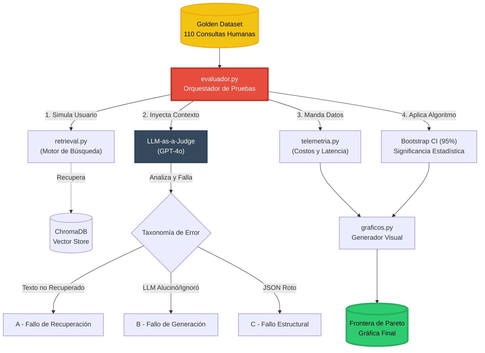

# ⚖️ Arquitectura del Módulo Evaluador (LLM-as-a-Judge)

Este diagrama detalla cómo opera el orquestador de pruebas (`evaluador.py`), simulando un laboratorio de MLOps automatizado que corre cientos de pruebas, mide costos y grafica la Frontera de Pareto.

---

## 1. Topología del Pipeline de Evaluación (Mermaid)

---

## 2. Flujo Explicado

1. **Ingesta de la Verdad:** El evaluador lee el *Ground Truth* (las 110 preguntas curadas por expertos con sus respuestas exactas esperadas).
2. **Simulación de Tráfico:** `evaluador.py` agarra cada pregunta y se la lanza al sistema real de búsqueda (`retrieval.py`). Prende un cronómetro para medir la latencia y cuenta los tokens gastados enviando esos datos a `telemetria.py`.
3. **El Juez Implacable:** Los fragmentos recuperados y la respuesta generada se envían a un Juez (típicamente el modelo más inteligente, como GPT-4o). Este juez no usa Regex, usa razonamiento para emitir un veredicto en 3 niveles (Taxonomía A/B/C).
4. **Validación Científica:** Los puntajes individuales de NDCG se pasan por un algoritmo de **Bootstrapping** para calcular intervalos de confianza al 95%.
5. **Decisión Final:** Todos los datos (Costos de telemetría vs NDCG con Bootstrapping) convergen en `graficos.py`, el cual dibuja la Frontera de Pareto para poder elegir la arquitectura ganadora objetivamente.
