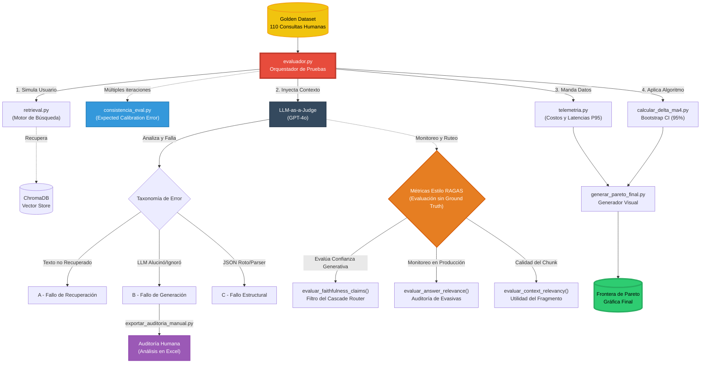

# ⚖️ Arquitectura del Módulo Evaluador (LLM-as-a-Judge)

Este diagrama detalla cómo opera el orquestador de pruebas (`evaluador.py`) junto con todos sus módulos satélite del **Avance 5 y 6**, simulando un laboratorio de MLOps automatizado que corre cientos de pruebas, clasifica errores, mide costos y grafica la Frontera de Pareto.

---

## 1. Topología del Pipeline de Evaluación (Mermaid)

```mermaid
graph TD
    %% Base de la Verdad
    A[("Golden Dataset<br>110 Consultas Humanas")] --> B

    %% Orquestador de Evaluación y Consistencia
    B["evaluador.py<br>Orquestador de Pruebas"] -->|1. Simula Usuario| C["retrieval.py<br>(Motor de Búsqueda)"]
    C -.->|Recupera| D[("ChromaDB<br>Vector Store")]
    
    %% Satélite de Consistencia
    B -.->|Múltiples iteraciones| ECE["consistencia_eval.py<br>(Expected Calibration Error)"]
    
    %% Juez y Taxonomía (MA6)
    B -->|2. Inyecta Contexto| E["LLM-as-a-Judge<br>(GPT-4o)"]
    E -->|Analiza y Falla| F{"Taxonomía de Error"}
    
    %% Ramas de Taxonomía
    F -->|Texto no Recuperado| G["A - Fallo de Recuperación"]
    F -->|LLM Alucinó/Ignoró| H["B - Fallo de Generación"]
    F -->|JSON Roto/Parser| I["C - Fallo Estructural"]
    
    %% Auditoría
    H -->|exportar_auditoria_manual.py| N["Auditoría Humana<br>(Análisis en Excel)"]

    %% Métricas RAGAS Satélites (NUEVO)
    E -.->|Monitoreo y Ruteo| RAGAS{"Métricas Estilo RAGAS<br>(Evaluación sin Ground Truth)"}
    RAGAS -->|Evalúa Confianza Generativa| FTH["evaluar_faithfulness_claims()<br>Filtro del Cascade Router"]
    RAGAS -->|Monitoreo en Producción| AR["evaluar_answer_relevance()<br>Auditoría de Evasivas"]
    RAGAS -->|Calidad del Chunk| CR["evaluar_context_relevancy()<br>Utilidad del Fragmento"]

    %% Métricas y Salida
    B -->|3. Manda Datos| J["telemetria.py<br>(Costos y Latencias P95)"]
    B -->|4. Aplica Algoritmo| K["calcular_delta_ma4.py<br>Bootstrap CI (95%)"]
    J --> L
    K --> L["generar_pareto_final.py<br>Generador Visual"]
    L --> M[("Frontera de Pareto<br>Gráfica Final")]

    %% Estilos
    style B fill:#e74c3c,stroke:#c0392b,stroke-width:4px,color:white
    style A fill:#f1c40f,stroke:#f39c12,stroke-width:2px,color:black
    style E fill:#34495e,stroke:#2c3e50,stroke-width:2px,color:white
    style M fill:#2ecc71,stroke:#27ae60,stroke-width:4px,color:black
    style N fill:#9b59b6,stroke:#8e44ad,stroke-width:2px,color:white
    style ECE fill:#3498db,stroke:#2980b9,stroke-width:2px,color:white
    style RAGAS fill:#e67e22,stroke:#d35400,stroke-width:2px,color:white
```

---

## 2. Flujo Explicado (Actualizado Avances 5 y 6)

1. **Ingesta de la Verdad:** El evaluador lee el *Ground Truth* (las 110 preguntas curadas por expertos con sus respuestas exactas esperadas).
2. **Simulación de Tráfico:** `evaluador.py` agarra cada pregunta y se la lanza al sistema real de búsqueda (`retrieval.py`). Prende un cronómetro para medir la latencia (enfocado en el percentil P95) y cuenta los tokens gastados enviando esos datos a `telemetria.py`.
3. **Calibración y Consistencia:** En paralelo, el sistema puede disparar `consistencia_eval.py` para medir la estabilidad de la respuesta del modelo ante temperatura > 0, detectando alucinaciones encubiertas.
4. **El Juez Implacable:** Los fragmentos recuperados y la respuesta generada (extraída vía Pydantic o QA) se envían a un Juez (GPT-4o). Éste emite un veredicto en 3 niveles (Taxonomía A/B/C). 
5. **Auditoría Humana:** Los errores graves de tipo B (Alucinaciones) fluyen hacia un exportador en Excel diseñado para que un experto humano clasifique la magnitud del fallo.
6. **Validación Científica:** Los puntajes individuales (como NDCG@10, Recall) se pasan por el script de **Bootstrapping** para calcular intervalos de confianza al 95% y demostrar empíricamente si las mejoras (como el Ensamble Cascade o el Contextual Retrieval) son estadísticamente significativas.
7. **Decisión Final:** Todos los datos (Costos de telemetría vs NDCG) convergen en el generador visual, el cual dibuja la Frontera de Pareto final, justificando el retorno de inversión del proyecto.

---

## 3. Métricas Satelitales Estilo RAGAS (Reference-Free)

Además de la evaluación tradicional contra un dataset humano (*Ground Truth*), el archivo `evaluador.py` expone funciones de vanguardia que utilizan al LLM como Juez para evaluar métricas **"Reference-Free"** (sin necesidad de tener la respuesta correcta a mano).

*   **`evaluar_faithfulness_claims()`**: 
    - **Uso Operativo:** Está conectada directamente dentro del núcleo de `generacion.py`.
    - **Función:** Actúa como el filtro decisivo del **Cascade Router**. Extrae las afirmaciones (*claims*) del modelo local y valida si están fundamentadas en el texto recuperado. Si el puntaje es menor a 0.80, el sistema intercepta la respuesta y la escala a la nube, previniendo activamente que el usuario lea una alucinación.
*   **`evaluar_answer_relevance()`**:
    - **Uso Operativo:** Diseñada para el **Monitoreo Asíncrono en Producción**.
    - **Función:** Utiliza ingeniería inversa (genera preguntas hipotéticas a partir de la respuesta del bot) para medir matemáticamente si el bot está respondiendo el "espíritu" de la consulta original o si está evadiendo la pregunta. Es ideal para correr en *cron jobs* nocturnos sobre los logs del sistema, levantando alertas si la relevancia promedio cae.
*   **`evaluar_context_relevancy()`**:
    - **Función:** Evalúa la proporción de oraciones del fragmento recuperado que son verdaderamente útiles para responder la pregunta, castigando a los fragmentos muy ruidosos o poco informativos.
