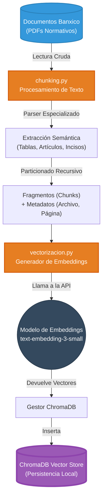

# 📥 Arquitectura del Módulo de Ingesta (ETL Vectorial)

Este diagrama detalla cómo se procesan los documentos regulatorios "crudos" de Banxico (CUB, LIC, etc.) hasta convertirse en fragmentos matemáticos listos para ser buscados por el RAG.

---

## 1. Topología del Pipeline de Ingesta (Mermaid)

---

## 2. Flujo Explicado

1. **Extracción (Extract):** Los documentos fuente (PDFs pesados como la CUB o la Ley de Instituciones de Crédito) son leídos por el script `chunking.py`. No se lee como texto plano, sino que se respeta la jerarquía legal (Capítulos, Artículos, Incisos) para no perder el contexto.
2. **Transformación (Transform):** Los textos gigantes se parten en pedazos pequeños (*chunks*). Se les inyectan **Metadatos**, es decir, el fragmento guarda la memoria de qué página y qué archivo vino. Esto es clave para el RAG Multi-Documento.
3. **Carga (Load):** `vectorizacion.py` toma cada fragmento y lo pasa por el modelo matemático (Ej. `text-embedding-3-small` de OpenAI). Esto convierte las palabras en una lista de números (vectores). Finalmente, se guardan en **ChromaDB**, que funcionará como nuestro "Cerebro de Memoria a Largo Plazo".
