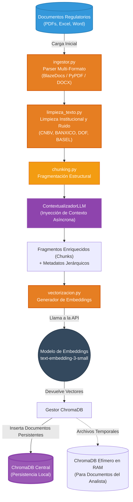

# 📥 Arquitectura del Módulo de Ingesta (ETL Vectorial)

Este diagrama detalla cómo se procesan los documentos regulatorios "crudos" multi-formato y de diferentes instituciones hasta convertirse en fragmentos matemáticos contextualizados, listos para ser buscados por el RAG.

---

## 1. Topología del Pipeline de Ingesta (Mermaid)

```mermaid
graph TD
    %% Fuentes de Datos
    A[("Documentos Regulatorios<br>(PDFs, Excel, Word)")] -->|Carga Inicial| ING
    ING["ingestor.py<br>Parser Multi-Formato<br>(BlazeDocs / PyPDF / DOCX)"] --> B

    %% Limpieza Institucional
    B["limpieza_texto.py<br>Limpieza Institucional y Ruido<br>(CNBV, BANXICO, DOF, BASEL)"] --> C

    %% Procesamiento y Contextual Retrieval
    C["chunking.py<br>Fragmentación Estructural"] --> CR["ContextualizadorLLM<br>(Inyección de Contexto Asíncrona)"]
    CR --> D["Fragmentos Enriquecidos (Chunks)<br>+ Metadatos Jerárquicos"]

    %% Vectorización
    D --> E["vectorizacion.py<br>Generador de Embeddings"]
    E -->|Llama a la API| F(("Modelo de Embeddings<br>text-embedding-3-small"))
    F -->|Devuelve Vectores| G

    %% Almacenamiento
    G["Gestor ChromaDB"] -->|Inserta Documentos Persistentes| H[("ChromaDB Central<br>(Persistencia Local)")]
    G -.->|Archivos Temporales| RAM[("ChromaDB Efímero en RAM<br>(Para Documentos del Analista)")]

    %% Estilos
    style A fill:#3498db,stroke:#2980b9,stroke-width:2px,color:white
    style ING fill:#e67e22,stroke:#d35400,stroke-width:2px,color:white
    style B fill:#e67e22,stroke:#d35400,stroke-width:2px,color:white
    style C fill:#f39c12,stroke:#e67e22,stroke-width:2px,color:white
    style CR fill:#8e44ad,stroke:#9b59b6,stroke-width:2px,color:white
    style E fill:#e67e22,stroke:#d35400,stroke-width:2px,color:white
    style H fill:#9b59b6,stroke:#8e44ad,stroke-width:4px,color:white
    style F fill:#34495e,stroke:#2c3e50,stroke-width:2px,color:white
```

---

## 2. Flujo Explicado (Actualizado Avances 5 y 6)

1. **Extracción (Extract):** El sistema `ingestor.py` recibe documentos de cualquier formato (PDF, Word, Excel). Para PDFs usa BlazeDocs (OCR avanzado) con un *fallback* a `pypdf`, y librerías nativas para Word y tablas de Excel. Los transforma a un formato Markdown universal respetando jerarquías.
2. **Limpieza Institucional:** Los documentos generados pasan por `limpieza_texto.py`, un módulo especializado que aplica Expresiones Regulares para eliminar "ruido" específico según la institución de origen (por ejemplo, firmas del Diario Oficial de la Federación, pies de página de la CNBV, números de página aislados del Comité de Basilea), sin corromper el contenido.
3. **Fragmentación (Chunking):** Los textos limpios entran a `chunking.py`. No se dividen a ciegas, sino respetando los encabezados y párrafos normativos (Títulos, Capítulos, Artículos).
4. **Contextual Retrieval (Inyección de Contexto):** Antes de la vectorización, los fragmentos pasan por el `ContextualizadorLLM`. Este módulo asíncrono interroga a un modelo económico (`gpt-4o-mini`) pidiéndole que redacte una frase de contexto para el fragmento basado en el documento global, resolviendo así el problema de la orfandad semántica.
5. **Carga (Load):** `vectorizacion.py` toma cada fragmento y lo pasa por el modelo matemático (Ej. `text-embedding-3-small` de OpenAI). 
6. **Almacenamiento (ChromaDB):** Los vectores se indexan junto con todos sus metadatos (Institución, Tema, Versión). Se puede enviar a la base de datos persistente (colección principal) o instanciarse al vuelo en una **Base Efímera en RAM** cuando el usuario sube un documento privado para análisis rápido en la interfaz gráfica.
