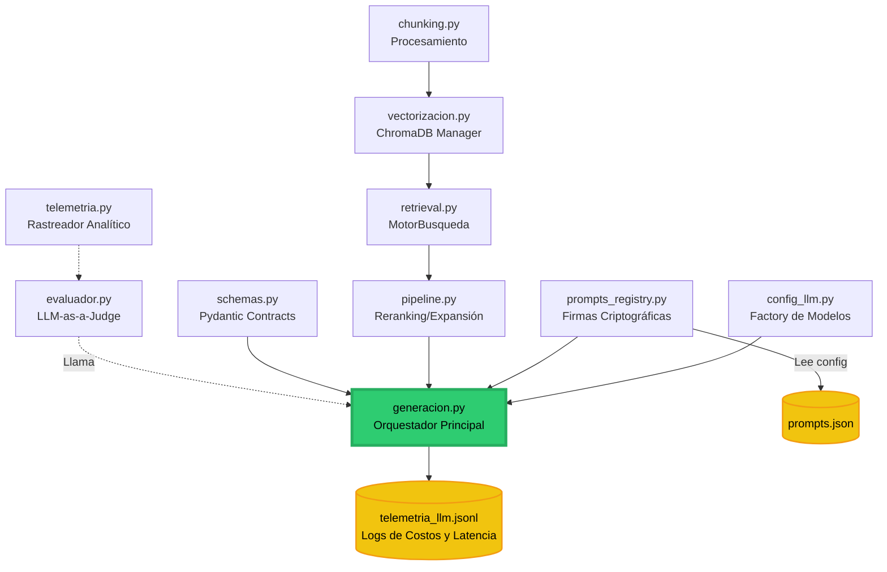

# 🧠 Arquitectura Interna del Motor NLP (`src/nlp_core/`)

Este documento es un complemento técnico o "Zoom-in" que ilustra la topología y el flujo de dependencias entre todos los scripts principales que conforman el corazón del sistema (el módulo `nlp_core`).

---

## 1. Topología de Dependencias (Mermaid)

El siguiente diagrama muestra cómo interactúan los scripts en tiempo de ejecución para lograr la recuperación y generación (RAG) con trazabilidad completa.

---

## 2. Descripción de Flujos y Módulos

### 🌟 El Orquestador Central
- **`generacion.py`**: Es el cerebro del RAG. Ningún otro script llama directamente a OpenAI o a Ollama. Este archivo consolida todo:
  1. Le pide a `retrieval.py` / `pipeline.py` los fragmentos.
  2. Le pide a `config_llm.py` el modelo correcto (Nube o Local).
  3. Le pide a `prompts_registry.py` el prompt y su firma (Hash).
  4. Obliga al modelo a responder bajo el contrato JSON definido en `schemas.py`.
  5. Escribe silenciosamente el costo en disco (JSONL).

### 🧩 La Capa de Recuperación (Retrieval)
- **`chunking.py`**: Lee los PDFs originales y los parte en fragmentos semánticos.
- **`vectorizacion.py`**: Convierte esos fragmentos a números (Embeddings) y los guarda en ChromaDB.
- **`retrieval.py`**: Contiene la clase `MotorBusqueda` para hacer consultas puras (k-NN o BM25).
- **`pipeline.py`**: Envuelve al Motor de Búsqueda para aplicarle estrategias corporativas: expandir la pregunta del usuario, recuperar fragmentos y luego filtrarlos usando un *Cross-Encoder* (Reranking).

### 🔒 La Capa de Configuración y Seguridad
- **`config_llm.py`**: Un *Factory* puro. Decide en microsegundos si instanciar a OpenAI (pago) o a Ollama (gratuito local) basado en tu archivo `.env`.
- **`prompts_registry.py`**: Mantiene un diccionario de instrucciones (`prompts.json`). Cada vez que sirve un prompt, le calcula un Hash SHA-256 inmutable para auditar exactamente qué instrucción se ejecutó.
- **`schemas.py`**: Contiene los moldes de Pydantic. Evita que el LLM devuelva prosa libre y lo fuerza a devolver diccionarios exactos que el backend pueda consumir.

### 📊 La Capa de Análisis (Laboratorio)
- **`telemetria.py`**: Usado estrictamente para generar el tarifario (Costos y Latencias) que alimenta las métricas de la Frontera de Pareto.
- **`evaluador.py`**: Implementa el patrón *LLM-as-a-Judge*. Llama al sistema, recibe la respuesta y la somete a un escrutinio rígido, dividiendo los errores en taxonomía A/B/C.
