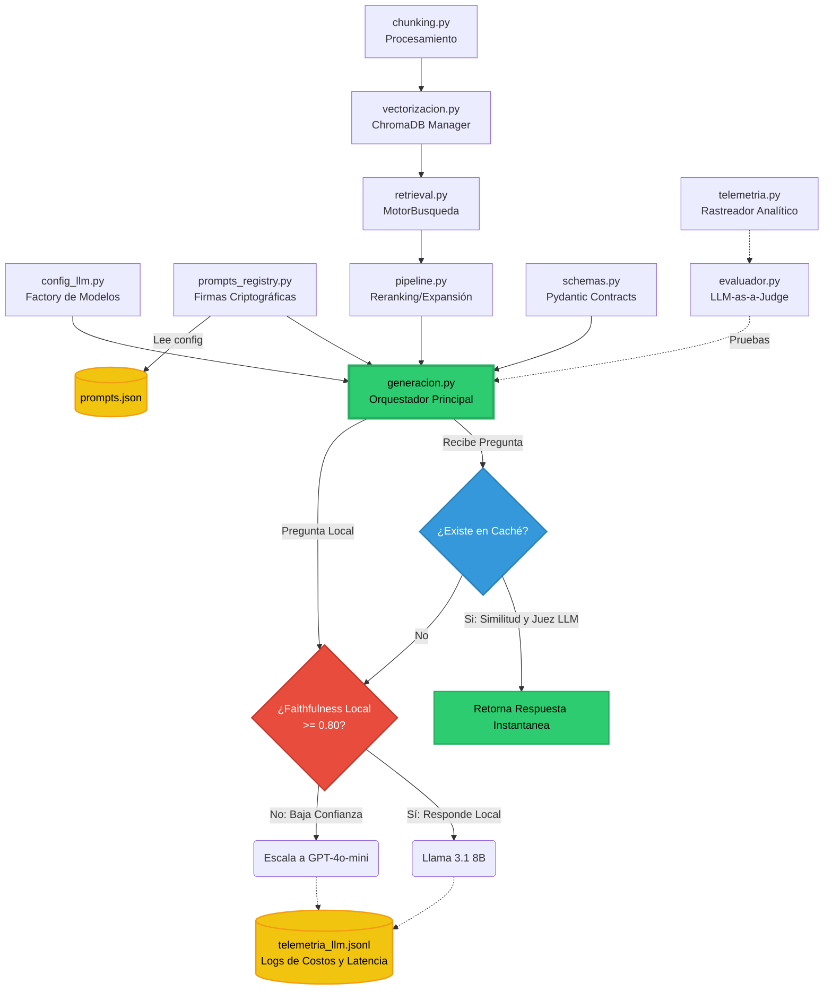

# 🧠 Arquitectura Interna del Motor NLP (`src/nlp_core/`)

Este documento es un complemento técnico o "Zoom-in" que ilustra la topología y el flujo de dependencias entre todos los scripts principales que conforman el corazón del sistema (el módulo `nlp_core`), actualizado con las innovaciones del **Avance 5**.

---

## 1. Topología de Dependencias (Mermaid)

El siguiente diagrama muestra cómo interactúan los scripts en tiempo de ejecución para lograr la recuperación y generación (RAG), incorporando el nuevo **Ensamble Heterogéneo (Router Cascade)**.

```mermaid
graph TD
    %% Componentes Fundacionales
    A["config_llm.py<br>Factory de Modelos"] --> G["generacion.py<br>Orquestador Principal"]
    B["prompts_registry.py<br>Firmas Criptográficas"] --> G
    B -->|Lee config| C[("prompts.json")]
    
    %% Flujo de Recuperación
    D["vectorizacion.py<br>ChromaDB Manager"] --> E["retrieval.py<br>MotorBusqueda"]
    H["chunking.py<br>Procesamiento"] --> D
    E --> F["pipeline.py<br>Reranking/Expansión"]
    F --> G
    
    %% Caché Semántico Híbrido
    G -->|Recibe Pregunta| CACHE{"¿Existe en Caché?"}
    CACHE -->|Si: Similitud y Juez LLM| CACHE_HIT["Retorna Respuesta Instantanea"]
    CACHE -->|No| R1
    
    %% Router Cascade (Avance 5)
    G -->|Pregunta Local| R1{"¿Faithfulness Local<br> >= 0.80?"}
    R1 -->|Sí: Responde Local| S1("Llama 3.1 8B")
    R1 -->|No: Baja Confianza| S2("Escala a GPT-4o-mini")
    S1 -.-> J
    S2 -.-> J
    
    %% Validación y Monitoreo
    I["schemas.py<br>Pydantic Contracts"] --> G
    J[("telemetria_llm.jsonl<br>Logs de Costos y Latencia")]
    
    %% Laboratorio/Evaluación
    K["telemetria.py<br>Rastreador Analítico"] -.-> L["evaluador.py<br>LLM-as-a-Judge"]
    L -.->|Pruebas| G

    %% Estilos
    style G fill:#2ecc71,stroke:#27ae60,stroke-width:4px,color:black
    style R1 fill:#e74c3c,stroke:#c0392b,stroke-width:2px,color:white
    style CACHE fill:#3498db,stroke:#2980b9,stroke-width:2px,color:white
    style CACHE_HIT fill:#2ecc71,stroke:#27ae60,stroke-width:2px,color:black
    style C fill:#f1c40f,stroke:#f39c12,stroke-width:2px,color:black
    style J fill:#f1c40f,stroke:#f39c12,stroke-width:2px,color:black
```

---

## 2. Descripción de Flujos y Módulos

### 🌟 El Orquestador Central y el Ensamble Cascade
- **`generacion.py`**: Es el cerebro del RAG. Ningún otro script llama directamente a OpenAI o a Ollama. Ahora cuenta con la super-función `responder_rag_cascade_qa`, la cual implementa el **Ensamble Heterogéneo y el Caché Semántico**:
  1. **Caché Semántico Híbrido**: Antes de buscar, evalúa matemáticamente si la pregunta se parece a una anterior. Si es así, despierta al **Juez LLM (Llama 3.1)** para confirmar la intención. Si aprueba, devuelve la respuesta en `~0.5s` evadiendo la latencia RAG.
  2. Le pide a `retrieval.py` / `pipeline.py` los fragmentos.
  3. Consulta al modelo Local (Llama 3.1) y **autoevalúa** la respuesta mediante una métrica de Confianza (Faithfulness).
  4. Si la confianza es alta, devuelve la respuesta y evita costos. Si la confianza es baja (menor al umbral), desecha la respuesta y redirige la carga hacia la Nube (GPT-4o-mini).
  5. Obliga al modelo a responder bajo el contrato JSON definido en `schemas.py` y escribe la telemetría en disco.

### 🧩 La Capa de Recuperación (Retrieval)
- **`chunking.py`**: Lee los PDFs originales y los parte en fragmentos semánticos.
- **`vectorizacion.py`**: Convierte esos fragmentos a números (Embeddings) y los guarda en ChromaDB.
- **`retrieval.py`**: Contiene la clase `MotorBusqueda` para hacer consultas puras (k-NN o BM25).
- **`pipeline.py`**: Envuelve al Motor de Búsqueda para aplicarle estrategias corporativas: expandir la pregunta del usuario, recuperar fragmentos y luego filtrarlos usando un *Cross-Encoder* (Reranking).

### 🔒 La Capa de Configuración y Seguridad
- **`config_llm.py`**: Un *Factory* puro. Decide en microsegundos si instanciar a OpenAI (pago) o a Ollama (gratuito local) basado en tu archivo `.env`.
- **`prompts_registry.py`**: Mantiene un diccionario de instrucciones (`prompts.json`). Cada vez que sirve un prompt, le calcula un Hash SHA-256 inmutable para auditar.
- **`schemas.py`**: Contiene los moldes de Pydantic para Forzar al LLM a devolver estructuras válidas.

### 📊 La Capa de Análisis (Laboratorio)
- **`telemetria.py`**: Usado estrictamente para generar el tarifario (Costos y Latencias P50/P95/P99) que alimenta las métricas de la Frontera de Pareto.
- **`evaluador.py`**: Implementa el patrón *LLM-as-a-Judge*.
