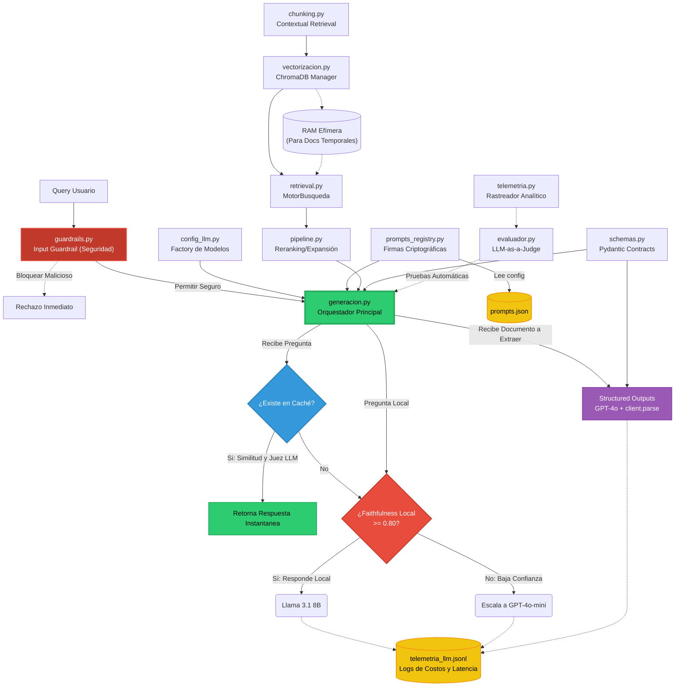

# 🧠 Arquitectura Interna del Motor NLP (`src/nlp_core/`)

Este documento es un complemento técnico o "Zoom-in" que ilustra la topología y el flujo de dependencias entre todos los scripts principales que conforman el corazón del sistema (el módulo `nlp_core`), actualizado con las innovaciones de Seguridad y Robustez de los **Avances 5 y 6**.

---

## 1. Topología de Dependencias (Mermaid)

El siguiente diagrama muestra cómo interactúan los scripts en tiempo de ejecución para lograr la recuperación y generación (RAG), incorporando la nueva **Capa de Seguridad Perimetral (Guardrails)** y el **Ensamble Heterogéneo (Router Cascade)**.

```mermaid
graph TD
    %% Seguridad y Firewall (Avance 6)
    U[Query Usuario] --> GR["guardrails.py<br>Input Guardrail (Seguridad)"]
    GR -.->|Bloquear Malicioso| O[Rechazo Inmediato]
    GR -->|Permitir Seguro| G["generacion.py<br>Orquestador Principal"]

    %% Componentes Fundacionales
    A["config_llm.py<br>Factory de Modelos"] --> G
    B["prompts_registry.py<br>Firmas Criptográficas"] --> G
    B -->|Lee config| C[("prompts.json")]
    
    %% Flujo de Recuperación Híbrido
    D["vectorizacion.py<br>ChromaDB Manager"] --> E["retrieval.py<br>MotorBusqueda"]
    D -.-> RAM[("RAM Efímera<br>(Para Docs Temporales)")]
    RAM -.-> E
    H["chunking.py<br>Contextual Retrieval"] --> D
    E --> F["pipeline.py<br>Reranking/Expansión"]
    F --> G
    
    %% Caché Semántico Híbrido (Rama RAG)
    G -->|Recibe Pregunta| CACHE{"¿Existe en Caché?"}
    CACHE -->|Si: Similitud y Juez LLM| CACHE_HIT["Retorna Respuesta Instantanea"]
    CACHE -->|No| R1
    
    %% Router Cascade (Rama RAG)
    G -->|Pregunta Local| R1{"¿Faithfulness Local<br> >= 0.80?"}
    R1 -->|Sí: Responde Local| S1("Llama 3.1 8B")
    R1 -->|No: Baja Confianza| S2("Escala a GPT-4o-mini")
    S1 -.-> J
    S2 -.-> J
    
    %% Extracción Estructurada (Rama Long-Context)
    G -->|Recibe Documento a Extraer| P1["Structured Outputs<br>GPT-4o + client.parse"]
    P1 -.-> J
    
    %% Validación y Monitoreo
    I["schemas.py<br>Pydantic Contracts"] --> P1
    I --> G
    J[("telemetria_llm.jsonl<br>Logs de Costos y Latencia")]
    
    %% Laboratorio/Evaluación
    K["telemetria.py<br>Rastreador Analítico"] -.-> L["evaluador.py<br>LLM-as-a-Judge"]
    L -.->|Pruebas Automáticas| G

    %% Estilos
    style GR fill:#c0392b,stroke:#e74c3c,stroke-width:2px,color:white
    style G fill:#2ecc71,stroke:#27ae60,stroke-width:4px,color:black
    style R1 fill:#e74c3c,stroke:#c0392b,stroke-width:2px,color:white
    style CACHE fill:#3498db,stroke:#2980b9,stroke-width:2px,color:white
    style CACHE_HIT fill:#2ecc71,stroke:#27ae60,stroke-width:2px,color:black
    style C fill:#f1c40f,stroke:#f39c12,stroke-width:2px,color:black
    style J fill:#f1c40f,stroke:#f39c12,stroke-width:2px,color:black
    style P1 fill:#9b59b6,stroke:#8e44ad,stroke-width:2px,color:white
```

---

## 2. Descripción de Flujos y Módulos

### 🛡️ La Capa de Seguridad
- **`seguridad/guardrails.py`**: Intercepta absolutamente todas las consultas del usuario antes de que procesen. Evalúa heurísticamente y a través de un LLM lógico si el intento contiene *Prompt Injections*, *Jailbreaks* o toxicidad financiera. Actúa como el cortafuegos principal.

### 🌟 El Orquestador Central y el Ensamble Cascade
- **`generacion.py`**: Es el cerebro del RAG. Ahora cuenta con dos ramas masivas:
  1. **Vía RAG Conversacional (`responder_rag_cascade_qa`)**: Implementa el **Ensamble Heterogéneo y el Caché Semántico**. Consulta a Llama 3.1 local, autoevalúa el *Faithfulness* y si falla el umbral, dirige la pregunta a la nube.
  2. **Vía Extracción Estructurada (`extraer_full_context`)**: Llama directamente a la API de validación nativa de OpenAI (`client.beta.chat.completions.parse`) para obligar matemáticamente al modelo a respetar un esquema JSON Pydantic sin alucinaciones.

### 🧩 La Capa de Recuperación (Retrieval)
- **`chunking.py`**: Responsable del *Contextual Retrieval* asíncrono para solucionar problemas de pérdida de contexto al fragmentar.
- **`vectorizacion.py`**: Almacena de manera persistente en disco o genera Colecciones Efímeras en memoria RAM para analizar PDFs subidos por analistas al vuelo.
- **`retrieval.py`**: Su `MotorBusqueda` puede combinar la base documental oficial de Banxico con la base Efímera en RAM usando un `EnsembleRetriever`.
- **`pipeline.py`**: Envuelve al Motor de Búsqueda para aplicar expansiones (HyDE, Multi-Query) y filtrado estadístico mediante un modelo experto cruzado (*Cross-Encoder*).

### 🔒 La Capa de Configuración
- **`config_llm.py`**: Un *Factory* puro. Decide si instanciar LangChain/OpenAI/Ollama.
- **`prompts_registry.py`**: Gestor inmutable de `prompts.json` con firmado criptográfico SHA-256 para trazabilidad legal.
- **`schemas.py`**: Contiene los moldes de Pydantic (`RequerimientoInformacion`, `MetadataDocumento`) críticos para la Rama de Extracción Estructurada.

### 📊 La Capa de Análisis (Laboratorio)
- **`telemetria.py`**: Genera el tarifario de uso en producción.
- **`evaluador.py`**: El *LLM-as-a-Judge* capaz de realizar pruebas destructivas, validación de MLOps con Bootstrapping, e identificar fallos precisos.
